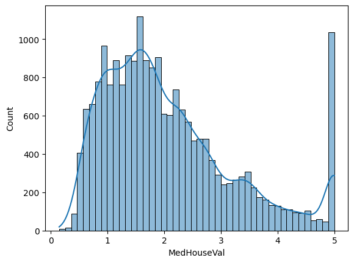
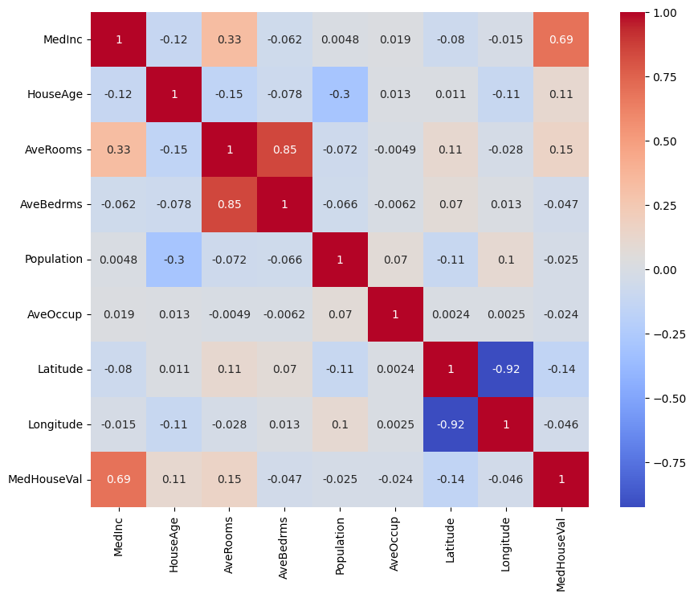
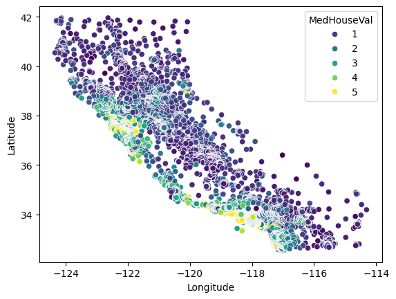
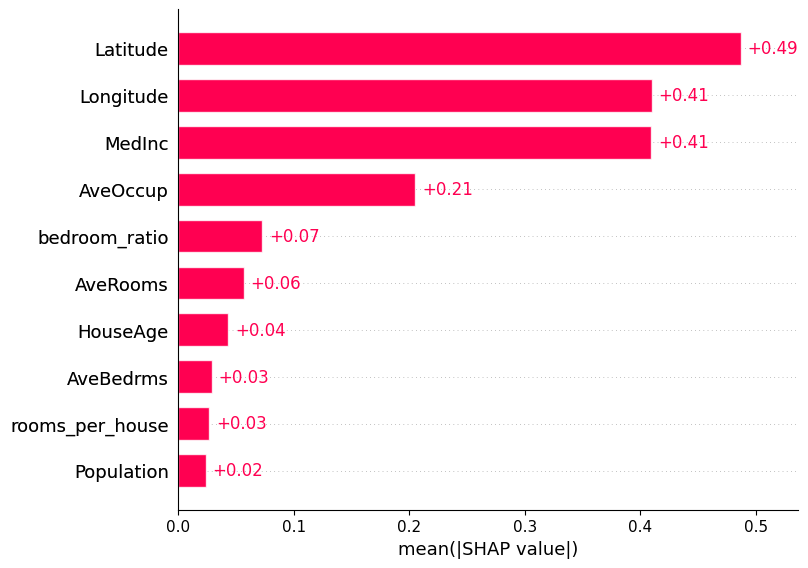

Phase 1 — Setup & Data Loading — get your environment ready, load California Housing data, understand all 8 features.

Phase 2 — EDA — visualize the target distribution, correlation heatmap, geographic price map, and clean outliers. This phase alone teaches more intuition than any textbook.

Phase 3 — Feature Engineering — create derived features (rooms per house, bedroom ratio, distance to SF/LA), do the train/val/test split, and scale features. The split-before-scale order matters — data leakage is the #1 beginner mistake.
Phase 4 — Model Training — build 4 models in order: Linear Regression → Ridge/Lasso → Random Forest → XGBoost with k-fold CV and hyperparameter tuning. You'll see R² jump from ~0.62 (linear) to ~0.84 (XGBoost).

Phase 5 — Evaluation — test set evaluation, residual plots, and SHAP values for interpretability. The SHAP section is what separates a student project from a professional one.

Phase 6 — Deployment — save the model, build a Streamlit UI with sliders, deploy to Streamlit Cloud for a public URL

# House Price Prediction App

This project is a Machine Learning + Streamlit web app that predicts house prices based on key housing features from the California Housing dataset.

# Overview

The model is trained using features like median income, house age, number of rooms, population, and geographic location to estimate house prices. The trained model is then deployed using Streamlit to provide an interactive UI for real-time predictions.

# Tech Stack
Python
Scikit-learn
XGBoost
Pandas & NumPy
Streamlit

# Features
Interactive sliders for user input
Real-time price prediction
Feature engineering (custom derived features)
Clean and responsive UI

# Model
Dataset: California Housing Dataset
Algorithm: XGBoost Regressor
Additional features:
Rooms per house
Bedroom ratio

# Steps to run

pip install -r requirements.txt

python train_model.py

streamlit run app.py

# Goal

To demonstrate an end-to-end ML pipeline:
data preprocessing → model training → evaluation → deployment

# Histogram

# Heatmap

# Scatterplot

# SHAP
